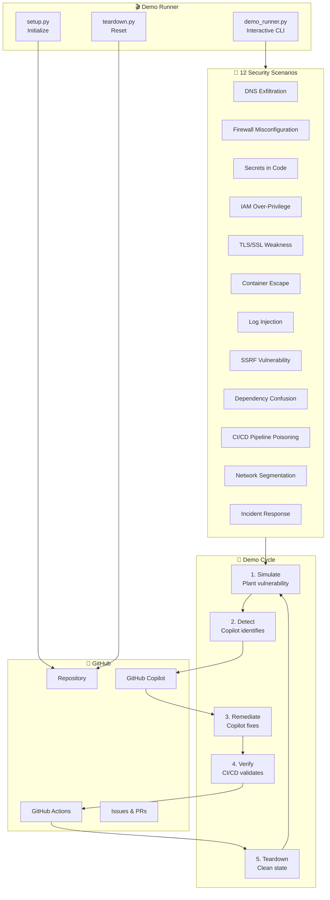

# 🛡️ IT Security Copilot Demo

[](https://github.com/features/copilot)
[](LICENSE)
[](https://python.org)

> **A live, interactive demo system showing enterprise customers how GitHub Copilot transforms IT Security & Network operations.**

---

## 📖 Overview — "A Day in the Life"

It's **8:00 AM**. The CIO receives an urgent alert: **DNS exfiltration detected** on the corporate network. Sensitive data may be leaking through encoded DNS queries to an unknown external domain.

What follows is a full-day journey through how an IT Security team, armed with **GitHub Copilot**, investigates, contains, remediates, hardens, and reports — all by **5:00 PM**.

| Time | Phase | What Happens |
|------|-------|--------------|
| 🕗 8:00 AM | **Alert** | DNS exfiltration alert fires — anomalous query patterns detected |
| 🕘 9:00 AM | **Investigate** | Team uses Copilot to analyze firewall logs, decode suspicious payloads |
| 🕙 10:00 AM | **Contain** | Copilot helps write network isolation scripts, block malicious domains |
| 🕚 11:00 AM | **Remediate** | Fix vulnerable configurations — DNS, firewall rules, IAM policies |
| 🕐 1:00 PM | **Harden** | Copilot generates hardened configs, secrets rotation, TLS enforcement |
| 🕓 3:00 PM | **Automate** | Build CI/CD security gates, scanning workflows, compliance checks |
| 🕔 5:00 PM | **Report** | Generate executive incident report, compliance documentation |

---

## 🏗️ Architecture



---

## ✅ Prerequisites

| Tool | Version | Purpose |
|------|---------|---------|
| [Git](https://git-scm.com/) | 2.30+ | Version control |
| [GitHub CLI (`gh`)](https://cli.github.com/) | 2.0+ | GitHub API interaction |
| [Python](https://python.org/) | 3.8+ | Demo scripts (stdlib only — no pip installs needed) |
| [VS Code](https://code.visualstudio.com/) | Latest | IDE for live Copilot demo |
| [GitHub Copilot](https://github.com/features/copilot) | Active license | AI-assisted coding |

---

## 🚀 Quick Start

```bash
# 1. Clone the repository
git clone https://github.com/sautalwar/it-security-copilot-demo.git
cd it-security-copilot-demo

# 2. Run setup (initializes baseline, pushes to GitHub)
python scripts/setup.py

# 3. Launch the interactive demo
python scripts/demo_runner.py

# 4. Teardown when done (soft reset)
python scripts/teardown.py

# 4b. Full teardown (deletes and recreates repo)
python scripts/teardown.py --hard
```

---

## 🎯 12 Security Scenarios

| # | Scenario | Description |
|---|----------|-------------|
| 1 | **DNS Exfiltration Detection** | Detect and block data exfiltration through encoded DNS queries to unauthorized external domains |
| 2 | **Firewall Misconfiguration** | Identify overly permissive firewall rules (0.0.0.0/0 ingress) and tighten to least-privilege |
| 3 | **Secrets in Source Code** | Find hardcoded API keys, passwords, and tokens; rotate and migrate to a secrets manager |
| 4 | **IAM Over-Privilege** | Detect wildcard IAM policies (`*:*`) and reduce to minimum required permissions |
| 5 | **TLS/SSL Weakness** | Find deprecated TLS 1.0/1.1 configs and weak cipher suites; enforce TLS 1.2+ |
| 6 | **Container Escape Risk** | Detect privileged containers and missing security contexts; apply pod security standards |
| 7 | **Log Injection** | Find unsanitized log inputs vulnerable to log forging; add proper encoding and validation |
| 8 | **SSRF Vulnerability** | Detect Server-Side Request Forgery in internal services; add URL validation and allowlists |
| 9 | **Dependency Confusion** | Identify packages vulnerable to dependency confusion attacks; pin registries and hashes |
| 10 | **CI/CD Pipeline Poisoning** | Find insecure GitHub Actions workflows (script injection, untrusted actions); harden pipelines |
| 11 | **Network Segmentation** | Detect flat network topologies; implement microsegmentation with security group policies |
| 12 | **Incident Response Automation** | Build automated incident response playbooks — from alert to containment to reporting |

---

## 🔄 How It Works

Each scenario follows a **five-step cycle**:

```
┌──────────┐    ┌──────────┐    ┌───────────┐    ┌──────────┐    ┌──────────┐
│ SIMULATE │───▶│  DETECT  │───▶│ REMEDIATE │───▶│  VERIFY  │───▶│ TEARDOWN │
│          │    │          │    │           │    │          │    │          │
│ Plant a  │    │ Copilot  │    │ Copilot   │    │ CI/CD    │    │ Reset to │
│ vuln in  │    │ helps    │    │ generates │    │ validates│    │ baseline │
│ the code │    │ find it  │    │ the fix   │    │ the fix  │    │ state    │
└──────────┘    └──────────┘    └───────────┘    └──────────┘    └──────────┘
```

1. **Simulate** — The demo runner plants a realistic vulnerability (e.g., a misconfigured firewall rule, a hardcoded secret) into the working tree
2. **Detect** — The presenter opens VS Code with Copilot and asks it to review the code for security issues
3. **Remediate** — Copilot suggests the fix; the presenter accepts and the demo runner commits the remediation
4. **Verify** — A GitHub Actions workflow runs security scanning to confirm the fix passes
5. **Teardown** — The environment resets to baseline, ready for the next scenario

---

## 📂 Directory Structure

```
it-security-copilot-demo/
├── README.md                          # This file
├── .gitignore                         # Git ignore rules
├── .env                               # Generated by setup (not committed)
├── scripts/
│   ├── setup.py                       # Master setup script
│   ├── teardown.py                    # Master teardown script
│   └── demo_runner.py                 # Interactive demo CLI
├── scenarios/
│   ├── 01-dns-exfiltration/
│   │   ├── baseline/                  # Vulnerable baseline files
│   │   ├── simulate.py                # Plants the vulnerability
│   │   └── remediate.py               # Applies the fix
│   ├── 02-firewall-misconfig/
│   │   ├── baseline/
│   │   ├── simulate.py
│   │   └── remediate.py
│   ├── ...                            # Scenarios 03–12 follow same pattern
│   └── 12-incident-response/
│       ├── baseline/
│       ├── simulate.py
│       └── remediate.py
├── vulnerable-app/                    # Target application (demo workload)
├── .github/
│   └── workflows/
│       └── security-scan.yml          # GitHub Actions security workflow
└── infra/                             # Infrastructure-as-code templates
```

---

## 🤝 Contributing

This is an internal demo tool. To add a new scenario:

1. Create a new directory under `scenarios/` following the naming convention
2. Add `baseline/`, `simulate.py`, and `remediate.py`
3. Register the scenario in `demo_runner.py`
4. Test the full cycle: setup → simulate → remediate → verify → teardown

---

## 📄 License

This project is licensed under the **MIT License** — see the [LICENSE](LICENSE) file for details.

---

<p align="center">
  <strong>Built with 💚 by the GitHub Copilot team</strong><br>
  <em>Empowering IT Security teams to move faster and safer</em>
</p>
